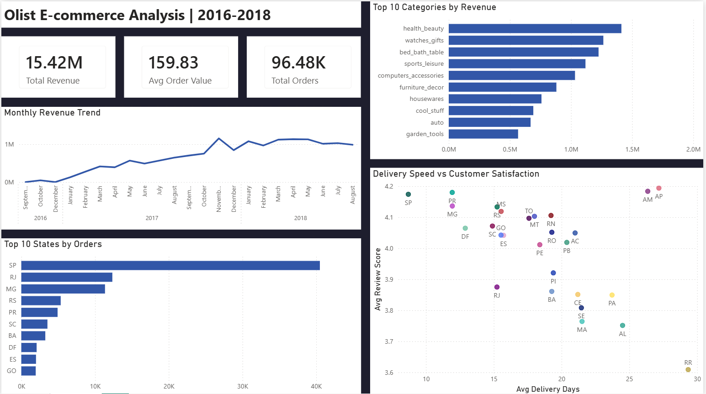

 # Olist E-commerce Analysis | SQL + Power BI

End-to-end data analysis project using PostgreSQL and Power BI on a real Brazilian e-commerce dataset with 100k+ orders. Covers data modeling, cleaning, analysis, and visualization.

---

## 📊 Dashboard

---

## 🛠️ Tools & Stack

| Tool | Purpose |
|---|---|
| PostgreSQL 16 | Database, data modeling, analysis |
| VS Code + SQLTools | Query editor |
| Power BI Desktop | Visualization |

---

## 📦 Dataset

Public dataset from Kaggle: [Brazilian E-Commerce Public Dataset by Olist](https://www.kaggle.com/datasets/olistbr/brazilian-ecommerce)

Olist is a Brazilian e-commerce marketplace aggregator that connects small retailers to major marketplaces. The dataset covers September 2016 to October 2018 and contains 8 interconnected tables.

| Table | Rows |
|---|---|
| orders | 99,441 |
| order_items | 112,650 |
| customers | 99,441 |
| sellers | 3,095 |
| products | 32,951 |
| order_payments | 103,886 |
| order_reviews | 99,224 |
| category_translation | 71 |

---

## 📁 Project Structure

olist-sql-analysis/
│
├── data/                         ← Raw CSV files (not pushed to GitHub)
│
├── queries/
│   ├── 01_schema.sql             ← Table creation
│   ├── 02_import.sql             ← Data import
│   ├── 02b_data_quality.sql      ← Data quality checks
│   ├── 03_exploration.sql        ← First look at the data
│   ├── 04_revenue.sql            ← Revenue analysis
│   ├── 05_customers.sql          ← Customer behavior
│   ├── 06_sellers.sql            ← Seller performance
│   └── 07_cohorts.sql            ← Cohort retention analysis
│
├── dashboard.png                 ← Power BI dashboard screenshot
└── README.md

---

## 🔍 Key Findings

**Revenue**
- R$15.4M total revenue across 96,478 delivered orders
- Average order value of R$159.83
- Clear growth trend from early 2017, with a Black Friday spike in November 2017 nearly doubling the previous month's revenue
- Health & beauty leads in total revenue despite bed & bath having more units sold — indicating higher average prices in the beauty category

**Customers**
- 97% of customers purchased only once during the 2016-2018 period — reflecting the platform's early growth phase and a significant opportunity for re-engagement
- Smaller states like PB (R$235) and AL (R$220) show higher average order values than SP (R$124), suggesting different purchasing behavior in underserved markets

**Logistics**
- SP receives deliveries in 8.8 days on average — nearly 3x faster than AM (26.4 days)
- Clear correlation between delivery speed and review scores across all states
- RJ is an outlier: geographically close to SP but scores only 3.96, suggesting factors beyond delivery time affect satisfaction

**Sellers**
- 3,095 sellers averaging R$4,391 in revenue each
- SP hosts 57% of sellers and generates 63% of total revenue
- High on-time delivery rate does not guarantee high review scores — product quality and pricing also drive customer satisfaction

---

## 💡 Business Recommendations

1. **Retention program** — With 97% single-purchase customers, targeted re-engagement campaigns 30-60 days post-purchase could significantly impact revenue, especially in high avg-ticket states like PB and AL.

2. **Logistics investment in North and Northeast** — States like AM, AL, PA, and MA have the slowest deliveries and lowest satisfaction scores. Regional carrier partnerships or fulfillment centers could unlock underserved demand.

3. **Seller quality program** — Since on-time delivery alone doesn't guarantee high reviews, a seller rating threshold for marketplace visibility could incentivize quality improvements.

---

## 📋 Full Write-up

[View the full project write-up on Notion]([https://iris-edam-ee9.notion.site/Olist-E-commerce-Analysis-SQL-Power-BI-35e634e4837e8026b54de49889e05086?source=copy_link])